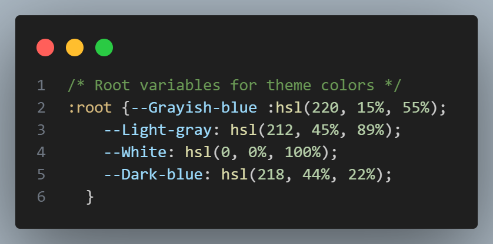

# Frontend Mentor - QR code component solution

This is a solution to the [QR code component challenge on Frontend Mentor](https://www.frontendmentor.io/challenges/qr-code-component-iux_sIO_H). Frontend Mentor challenges help you improve your coding skills by building realistic projects. 

## Table of contents

- [Overview](#overview)
  - [Screenshot](#screenshot)
  - [Links](#links)
- [My process](#my-process)
  - [Built with](#built-with)
  - [What I learned](#what-i-learned)
  - [Continued development](#continued-development)
  - [Useful resources](#useful-resources)
  - [Author](#author)

**Note: Delete this note and update the table of contents based on what sections you keep.**

## Overview

### Screenshot

### Links

- Solution URL: [Click here](https://your-solution-url.com)
- Live Site URL: [Click here](https://lu1zluna.github.io/qr-code-component/)

## My process

### Built with

- Semantic HTML5 markup
- CSS custom properties
- CSS Grid
- Flexbox

### What I learned

In this exercise, i could recap my knowledge in CSS, aswell to learn new things, such as having a brief introduction to flexbox and responsive design.

Also i learned how to assign custom properties (or variables)

### Continued development

At the moment, i'd like to get better with flexbox, learn how to properly use responsive design and know better ways to organize my code.

### Useful resources

- [Coding Fantsy](https://codingfantasy.com/games/flexboxadventure/play) - This helped me to understand flexbox by playing a game.

## Author

- Frontend Mentor - [@Lu1zLuna](https://www.frontendmentor.io/profile/Lu1zLuna)
